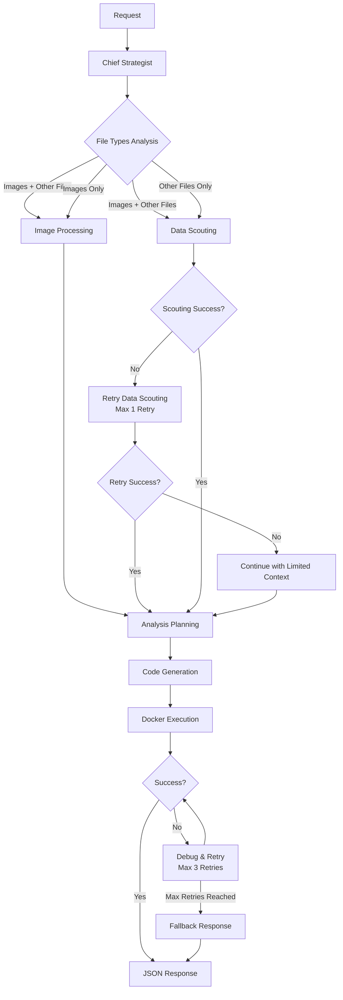

# 🤖 Data Analyst Agent

**An intelligent, automated data analysis system powered by advanced AI that can analyze any data source, from CSV files to images to web pages, and provide comprehensive insights in under 5 minutes.**

## 🌟 Overview

The Data Analyst Agent is a sophisticated FastAPI-based service that leverages multiple AI models to perform end-to-end data analysis. It accepts questions and data files, then automatically:

- **Strategically plans** the analysis approach
- **Acquires and scouts** data from various sources  
- **Processes images** using vision AI to extract structured data
- **Cleans and prepares** data intelligently
- **Executes analysis** in secure Docker sandboxes
- **Generates insights** in the exact format requested

## ✨ Key Features

### 🎯 **Multi-Modal Data Processing**
- **Structured Data**: CSV, JSON, Excel (.xlsx/.xls), TXT files
- **Documents**: PDF files with table extraction
- **Images**: Charts, graphs, tables, screenshots (PNG, JPG, JPEG, GIF, BMP, WebP)
- **Web Data**: HTML tables, scraped content from any website
- **Database**: SQL queries and database connections

### 🧠 **Intelligent Analysis Pipeline**
- **Strategic Planning**: AI determines optimal analysis approach
- **Dynamic Scouting**: Automatically understands data structure
- **Smart Cleaning**: Context-aware data preprocessing
- **Error Recovery**: Self-debugging with multiple retry attempts
- **Fallback Responses**: Graceful degradation when analysis fails

### 🔒 **Secure Execution**
- **Docker Sandbox**: Isolated code execution environment
- **Timeout Protection**: 5-minute maximum response time
- **Resource Limits**: Controlled memory and CPU usage
- **Error Containment**: Failures don't crash the system

### 📊 **Flexible Output**
- **JSON Responses**: Structured data outputs
- **Custom Formats**: Adapts to user requirements
- **Rich Insights**: Charts, tables, summaries, recommendations

## 🚀 Quick Start

### Prerequisites

- **Python 3.8+**
- **Docker** (with image building capabilities)
- **Anthropic API Key** (for AI model access)

### Installation

1. **Clone the repository**
```bash
git clone https://github.com/yourusername/data-analyst-agent.git
cd data-analyst-agent
```

2. **Install dependencies**
```bash
pip install -r requirements.txt
```

3. **Set up environment**
```bash
# Create .env file
echo "ANTHROPIC_API_KEY=your_api_key_here" > .env
```

4. **Build Docker sandbox image**
```bash
# Create Dockerfile for sandbox
cat > Dockerfile.sandbox << EOF
FROM python:3.11-slim

# Install system dependencies
RUN apt-get update && apt-get install -y \\
    gcc \\
    g++ \\
    && rm -rf /var/lib/apt/lists/*

# Install Python packages for data analysis
RUN pip install \\
    pandas \\
    numpy \\
    matplotlib \\
    seaborn \\
    requests \\
    beautifulsoup4 \\
    lxml \\
    openpyxl \\
    pymupdf \\
    pypdf \\
    pdfplumber \\
    duckdb \\
    plotly

WORKDIR /app
CMD ["bash"]
EOF

# Build the image
docker build -f Dockerfile.sandbox -t analyst-sandbox .
```

5. **Run the server**
```bash
python server.py
```

The API will be available at `http://localhost:8000`

## 📖 API Usage

### Endpoint
```
POST http://localhost:8000/api/
```

### Request Format
Send a multipart form request with:
- **`question.txt`** (required): Your analysis questions/requirements
- **Additional files** (optional): Data files, images, etc.

### Examples

#### Basic CSV Analysis
```bash
curl "http://localhost:8000/api/" \
  -F "question.txt=@question.txt" \
  -F "sales_data.csv=@data.csv"
```

#### Multi-Modal Analysis
```bash
curl "http://localhost:8000/api/" \
  -F "question.txt=@analysis_request.txt" \
  -F "chart_image.png=@chart.png" \
  -F "raw_data.csv=@data.csv" \
  -F "report.pdf=@quarterly_report.pdf"
```

#### Web Data Analysis  
```bash
# question.txt contains: "Scrape the latest stock prices from Yahoo Finance for AAPL and analyze the trend"
curl "http://localhost:8000/api/" \
  -F "question.txt=@web_analysis_question.txt"
```

## 📋 Supported Use Cases

### 📊 **Business Analytics**
- Sales performance analysis
- Customer segmentation  
- Market trend analysis
- Financial reporting
- KPI dashboards

### 🔬 **Data Science**
- Exploratory data analysis
- Statistical modeling
- Data visualization
- Correlation analysis  
- Predictive insights

### 📈 **Research & Reporting**
- Academic research analysis
- Survey data processing
- Report generation
- Literature reviews from PDFs
- Image data extraction

### 🌐 **Web Intelligence**
- Social media analytics
- Competitor analysis
- Market research
- Price monitoring
- Content analysis

## 🏗️ Architecture

### Analysis Pipeline Stages



### Core Components

#### 🎯 **Chief Strategist**
- Analyzes request and available data
- Determines processing strategy
- Routes to appropriate pipeline stages

#### 🔍 **Data Scout**  
- Inspects data structure and schema
- Handles multiple file formats
- Provides data previews for planning

#### 👁️ **Image Processor**
- Extracts tables from chart images
- Converts visual data to structured format  
- Handles multiple image formats

#### 🧠 **Analysis Planner**
- Creates detailed execution strategy
- Optimizes for performance and accuracy
- Handles data cleaning requirements

#### 🔧 **Code Generator**
- Writes Python analysis scripts
- Implements error handling
- Optimizes for sandbox execution

#### 🐳 **Docker Executor**
- Runs code in isolated environment
- Enforces timeouts and resource limits
- Captures outputs and errors

## ⚙️ Configuration

### Environment Variables
```bash
# Required
ANTHROPIC_API_KEY=your_api_key_here

# Optional - Advanced Configuration
MAX_DEBUG_RETRIES=3              # Code debugging attempts
MAX_ACQUISITION_RETRIES=1        # Data acquisition retries  
DOCKER_EXECUTION_TIMEOUT=180     # Docker timeout (seconds)
MAX_PIPELINE_TIMEOUT=300         # Total pipeline timeout
DOCKER_IMAGE_NAME=analyst-sandbox # Sandbox image name
```

### Performance Tuning
```python
# Adjust timeouts based on your needs
DOCKER_EXECUTION_TIMEOUT = 300    # 5 minutes for complex analysis
MAX_DEBUG_RETRIES = 5             # More retries for better success rate
```

## 🔧 Advanced Features

### Custom Data Sources
The agent can be extended to support additional data sources:

```python
# Add custom data acquisition logic
def acquire_database_data(connection_string):
    # Your database connection logic
    pass

def acquire_api_data(endpoint, headers):
    # Your API integration logic  
    pass
```

### Custom Analysis Types
Extend the analysis capabilities:

```python
# Add domain-specific analysis modules
def financial_analysis_module():
    # Financial modeling logic
    pass

def ml_analysis_module():  
    # Machine learning pipeline
    pass
```

## 📊 Example Outputs

### Sales Analysis
```json
{
  "total_revenue": "$2,450,000",
  "growth_rate": "15.3%",
  "top_products": [
    {"name": "Widget A", "revenue": "$850,000"},
    {"name": "Widget B", "revenue": "$640,000"}
  ],
  "recommendations": [
    "Focus marketing on Widget A segment",
    "Investigate Widget C declining sales"
  ],
  "chart_data": {
    "monthly_sales": [120000, 135000, 148000, ...]
  }
}
```

### Image Data Extraction
```json
{
  "extracted_tables": [
    {
      "table_name": "Q3 Results",  
      "headers": ["Region", "Sales", "Growth"],
      "data": [
        ["North", 150000, "12%"],
        ["South", 130000, "8%"]
      ]
    }
  ],
  "chart_insights": {
    "trend": "upward",
    "peak_month": "September",
    "growth_rate": "23%"
  }
}
```

## 🐛 Troubleshooting

### Common Issues

#### Docker Problems
```bash
# Check if Docker is running
docker ps

# Rebuild sandbox image
docker build -f Dockerfile.sandbox -t analyst-sandbox .

# Check container logs
docker logs analyst-sandbox-running
```

#### API Key Issues  
```bash
# Verify API key is set
echo $ANTHROPIC_API_KEY

# Test API access
curl https://api.anthropic.com/v1/messages \
  -H "x-api-key: $ANTHROPIC_API_KEY" \
  -H "content-type: application/json"
```

#### Memory/Timeout Issues
```python
# Increase timeouts in server.py
DOCKER_EXECUTION_TIMEOUT = 600  # 10 minutes
MAX_PIPELINE_TIMEOUT = 900      # 15 minutes
```

### Debugging Mode
Enable detailed logging:

```python
import logging
logging.basicConfig(level=logging.DEBUG)
```

## 🧪 Testing

### Run Test Suite
```bash
# Install test dependencies
pip install pytest pytest-asyncio

# Run all tests
pytest tests/

# Run specific test categories
pytest tests/test_analysis_pipeline.py
pytest tests/test_image_processing.py
pytest tests/test_data_acquisition.py
```

### Manual Testing
```bash
# Test basic functionality
echo "What is the average of these numbers: 10, 20, 30?" > test_question.txt
curl "http://localhost:8000/api/" -F "question.txt=@test_question.txt"

# Test with sample data
curl "http://localhost:8000/api/" \
  -F "question.txt=@sample_questions/sales_analysis.txt" \
  -F "data.csv=@sample_data/sales_data.csv"
```

## 🤝 Contributing

We welcome contributions! Please see our [Contributing Guide](CONTRIBUTING.md) for details.

### Development Setup
```bash
# Fork and clone the repository
git clone https://github.com/yourusername/data-analyst-agent.git

# Create development environment
python -m venv venv
source venv/bin/activate  # or `venv\Scripts\activate` on Windows

# Install development dependencies
pip install -r requirements-dev.txt

# Run tests before committing
pytest tests/
black server.py  # Format code
flake8 server.py  # Check code style
```

### Areas for Contribution
- 🔌 **New data source integrations**
- 📊 **Additional chart types and visualizations**
- 🧠 **Enhanced analysis algorithms**
- 🔧 **Performance optimizations**
- 📚 **Documentation improvements**
- 🐛 **Bug fixes and testing**

## 📄 License

This project is licensed under the MIT License - see the [LICENSE](LICENSE) file for details.

## 🙏 Acknowledgments

- **Anthropic** for the powerful AI models
- **FastAPI** for the robust web framework
- **Docker** for secure sandboxed execution
- **The open-source community** for the amazing data science tools

---

**⭐ If you find this project useful, please give it a star on GitHub!**

**🚀 Ready to analyze any data? Deploy your Data Analyst Agent today!**
